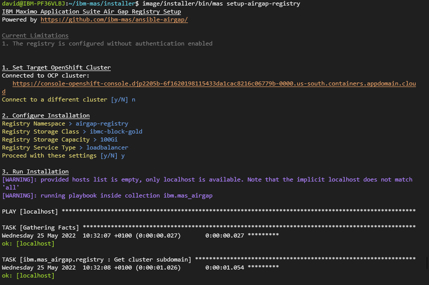

# MAS Air Gap Ansible Collection

Extension to **ibm.mas_devops** providing support for air gap deployments.

!!! important
    This collection and automation around air gap support is currently a work in progress and is incomplete!

## 1. Deploy private registry

There are multiple options for setting up your private registry:

- You can deploy the private registry inside the same OpenShift cluster that you intend to deploy Maximo Application Suite
- You can deploy the private registry in a seperate OpenShift cluster
- You can deploy the private registry on a normal server

!!! important
    Your target OCP cluster for MAS installation must have network access to the location that you set up your prviate container registry.

We have provided automation to deploy a private registry inside an OpenShift cluster.  You can use this to set up the regsitry in the same cluster that you will deploy MAS, or in a seperate cluster.

The easiest way drive the automation is to use the MAS command line container image and run `mas setup-registry` at the prompt:

```bash
$ docker run quay.io/ibmmas/installer:1.0.0-pre.master
```



Alternatively you can run the **ibm.mas_airgap.registry** Ansible role directly if your local machine meets all the required dependencies:

```bash
export REGISTRY_NAMESPACE=airgap-registry
export REGISTRY_STORAGE_CLASS=ibmc-block-gold
export REGISTRY_STORAGE_CAPACITY=100Gi
export REGISTRY_SERVICE_TYPE=loadbalancer
export ROLE_NAME=registry
ansible-playbook ibm.mas_airgap.run_role
```

## 2. Mirror images
The easiest way drive the automation is to use the MAS command line container image and run `mas mirror-images` at the prompt:

```bash
$ docker run quay.io/ibmmas/installer:1.0.0-pre.master
```

This will mirror all (or a subset) container images needed for a MAS installation to your private registry

Alternatively you can run the following Ansible playbooks directly if your local machine meets all the required dependencies:

```bash
export REGISTRY_PUBLIC_HOST=xxx
export REGISTRY_PUBLIC_PORT=xxx
ansible-playbook ibm.mas_airgap.mirror_common_services
ansible-playbook ibm.mas_airgap.mirror_sls
ansible-playbook ibm.mas_airgap.mirror_truststore_mgr
ansible-playbook ibm.mas_airgap.mirror_mas_core
ROLE_NAME=thirdparty_mirror ansible-playbook ibm.mas_airgap.run_role
```

## 3. Configure the target OCP cluster
The easiest way drive the automation is to use the MAS command line container image and run `mas configure-airgap` at the prompt:

```bash
$ docker run quay.io/ibmmas/installer:1.0.0-pre.master
```

This will configure your target OCP cluster to use a private docker register, install the operator catalogs required by MAS from that mirror, and install the necessary configmaps to instruct a MAS instance to use image digests instead of image tags so that image mirroring works.

Alternatively you can run the following Ansible playbooks directly if your local machine meets all the required dependencies:

```bash
export REGISTRY_PRIVATE_HOST=xxx
export REGISTRY_PRIVATE_PORT=xxx
export REGISTRY_PRIVATE_CA_FILE=xxx
export MAS_INSTANCE_ID=xxx
ROLE_NAME=ocp_contentsourcepolicy ansible-playbook ibm.mas_airgap.run_role
ROLE_NAME=catalogs ansible-playbook ibm.mas_airgap.run_role
ROLE_NAME=install_digest_cm ansible-playbook ibm.mas_airgap.run_role
```


## 4. Install Maximo Application Suite
`mas install` will install MAS, deploying the OpenShift Pipelines operator into your cluster & using it to launch the suite installation pipeline.

Alternatively, review the [ibm.mas_devops documentation](https://ibm-mas.github.io/ansible-devops/) for full details of the options available for installing MAS using Ansible.
